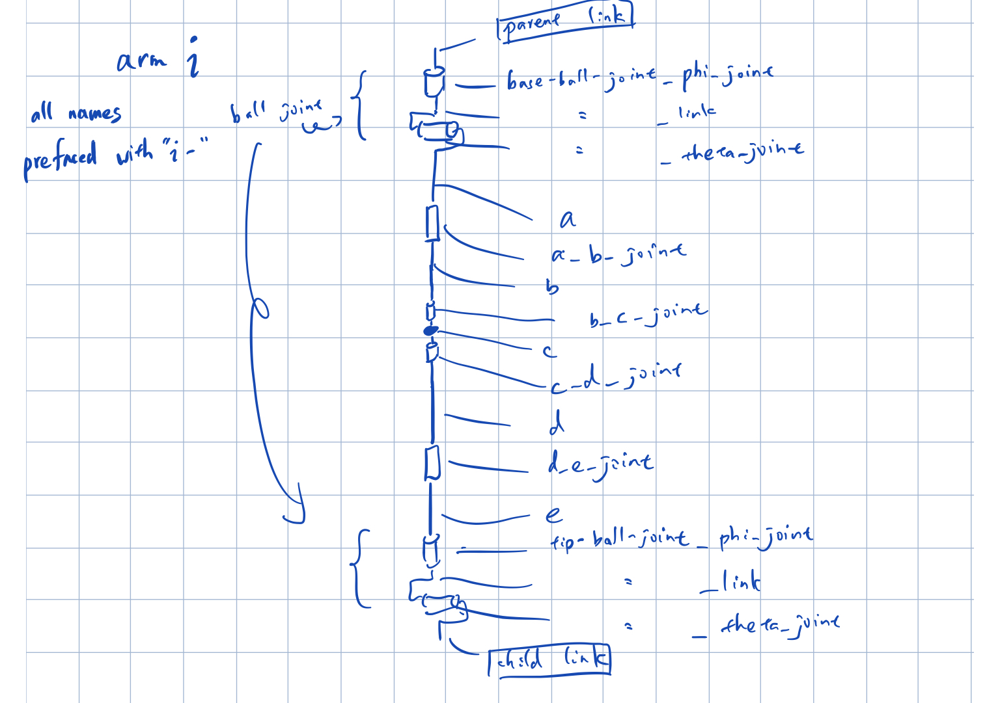

Holds URDF files that describe the robot.
Uses [XACRO](http://wiki.ros.org/xacro) for macros and such to make the URDF simpler.

To generate a URDF file from XACRO file, run `./create_urdf.sh`.

View the model in Rviz with `roslaunch rviz.launch`.

The URDF model currently does not accurately reflect the actual augmented model- needs two more joints in the center.

# link & joint naming conventions


# making PCC robot
create *robot.urdf.xacro* with contents;
```xml
<?xml version="1.0"?>

<robot xmlns:xacro="http://www.ros.org/wiki/xacro" name="robot">
  <xacro:include filename="macro_definitions.urdf.xacro" />
  <xacro:empty_link name="base_link"/>
  <xacro:PCC id="0" parent="base_link" child="0_mid" length="0.5" mass="1000"/>
  <xacro:empty_link name="middle"/>
  <xacro:PCC id="1" parent="middle" child="end_link" length = "0.5" mass="1000" />
  <xacro:empty_link name="end_link"/>
</robot>

```
convert to URDF with `./create_urdf.sh`